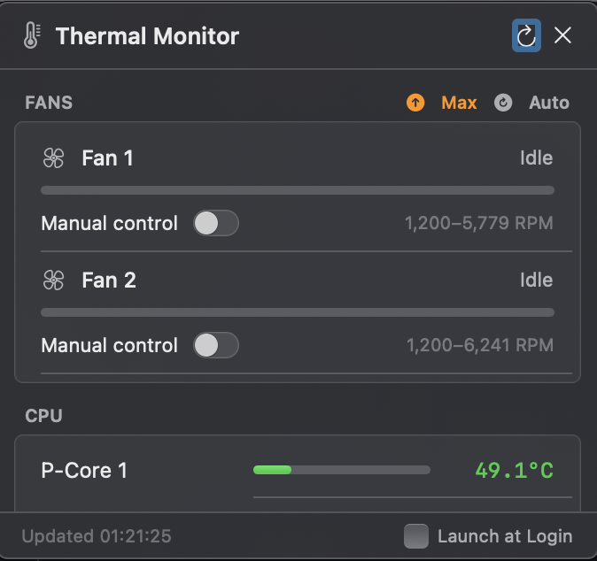

# ThermalMonitor

A lightweight macOS menu bar app that displays real-time CPU, GPU, storage, and battery temperatures from the SMC (System Management Controller). Supports fan speed monitoring and manual fan control on Macs with fans.

 



## Features

- Live temperature readings for CPU (P-cores + E-cores), GPU, storage, battery, and thermal sensors
- Color-coded temperature bars (green → yellow → orange → red)
- Fan speed monitoring with min/max range display
- Manual fan speed control via slider (requires one-time privileged helper install)
- Launch at Login toggle
- Auto-refreshes every second; instant refresh on wake from sleep
- Supports Apple Silicon M1–M4 (all variants) and Intel Macs

## Requirements

- macOS 13 Ventura or later
- Apple Silicon (arm64) — the build target is `arm64-apple-macos13.0`
- Xcode Command Line Tools (`xcode-select --install`)

## Build

```bash
# Build everything (helper + app bundle → build/ThermalMonitor.app)
make

# Build and launch immediately
make run

# Install to /Applications
make install

# Build + install + create DMG in ~/Downloads
make release
```

## Fan Control Setup

Fan writes require root. On first use, click **Enable Fan Control** in the popover — it runs a one-time install that copies a small setuid-root helper (`smc_write`) to `/usr/local/bin/`. You'll be prompted for your password once.

To install it manually from the terminal:

```bash
make install-helper   # requires sudo
```

To reset all fans back to automatic control, click **Auto** in the popover or quit the app.

## Project Structure

```
Sources/ThermalMonitor/
  ThermalMonitorApp.swift   — @main entry, menu bar label + color thresholds
  ThermalModel.swift        — Observable state, 1-second SMC polling, fan control
  SMCReader.swift           — Low-level IOKit/SMC wrapper (read + write via helper)
  PopoverContentView.swift  — Full popover UI (fans, sensors, footer)

helpers/
  smc_write.swift           — Privileged CLI helper compiled separately, installed setuid-root

Resources/
  Info.plist                — App bundle metadata
  AppIcon.icns              — Menu bar / Dock icon

scripts/
  make_dmg.sh              — Creates a distributable DMG with Finder layout
  make_icon.sh             — Generates AppIcon.icns from a source PNG
```

## How It Works

The app talks directly to the `AppleSMC` IOKit service to read temperature and fan SMC keys. Apple Silicon Macs use IEEE 754 `flt ` little-endian encoding; Intel Macs use `sp78` fixed-point. The `SMCParamStruct` has explicit padding fields to match the 80-byte C kernel layout exactly.

Fan RPM writes require root privileges, so they are delegated to `smc_write` — a small setuid-root binary embedded in the app bundle and installed on first use.
